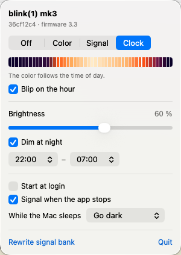
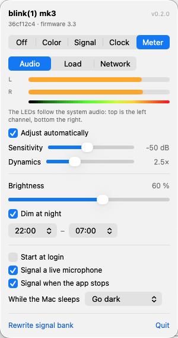
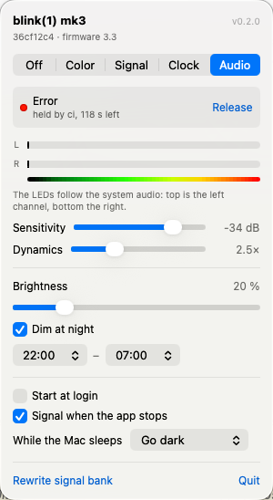

# Blink1

A Swift library, a command line tool and a menu bar app for the
[blink(1)](https://blink1.thingm.com) USB RGB LED on macOS — built to signal status events: build
results, alerts, whatever deserves a glance rather than a notification.

<p align="center">
  
</p>

No `hidapi`, no `libusb`, no driver, and no privacy permission: the device uses a vendor-defined HID
usage page, so macOS hands it over without the *Input Monitoring* prompt. The library depends on
nothing but IOKit; the tool adds
[swift-argument-parser](https://github.com/apple/swift-argument-parser).

The interesting part is not talking to the LED — it is **how little of the work the host has to do**.
A blink(1) can fade, play a pattern, react to a watchdog timer and decide what to show at power-on,
all by itself. Put the signals into the device once and a status change becomes a single 8-byte
command that keeps running through host sleep, a crashed daemon, or a logout.

Supports mk1 through mk4 with per-model capability checks; verified against a mk3 (firmware 3.3).
The protocol is written up in [PROTOCOL.md](PROTOCOL.md), including a handful of firmware behaviours
that are not in the official documentation because they were measured rather than read.

## Requirements

macOS 13 or later for the library and the tool, macOS 26 for the menu bar app. Swift 6.

Building the app additionally needs [XcodeGen](https://github.com/yonaskolb/XcodeGen) and
[Shark](https://github.com/kaandedeoglu/Shark) 2.2.0 or later; `make app` runs both.

## The tool

```sh
make build        # or: swift build -c release
make install      # into /usr/local/bin, override with PREFIX=~/.local
```

```sh
blink1 set green                       # light up green
blink1 set '#ff8800' --fade 500ms      # fade to amber over half a second
blink1 set red --led top               # address one LED (mk2 and later)
blink1 set random --brightness 0.2     # a dim surprise
blink1 blink red --count 5             # signal an alert
blink1 off

blink1 list                            # which devices are attached
blink1 info                            # model, firmware, capabilities
blink1 read --json                     # what is it showing right now
```

Colors are names (`red`, `green`, `blue`, `yellow`, `cyan`, `magenta`, `orange`, `amber`, `purple`,
`pink`, `teal`, `lime`, `white`, `black`), hex (`#ff8800`, `ff8800`, `#f80`), decimal triplets
(`255,136,0`), or `random`. Durations are `250ms`, `1.5s`, `2min`, or a bare number of milliseconds.

`--json` on `list`, `info`, `read`, `pattern show`, `pattern state` and `status` gives
machine-readable output; human-facing chatter goes to stderr, so pipes stay clean. `NO_COLOR`,
`--no-color` and a non-terminal stdout all disable color.

Exit codes: `0` success · `1` error · `2` no blink(1) found · `3` device busy or access denied ·
`64` usage error.

## The signal bank

Eleven status signals live in the device's 32 pattern slots at fixed addresses. Install them once,
then every status change is one command — and the device carries on signalling by itself:

```sh
blink1 bank install --brightness 0.6   # into RAM; add --save to keep it across power cycles
blink1 bank map                        # which signal owns which slots

blink1 signal busy
blink1 signal error
blink1 signal off
```

| Signal | Slots | Looks like |
|---|---|---|
| `idle` | 0–1 | dim teal, breathing slowly |
| `ok` | 2 | steady green |
| `off` | 3 | dark |
| `busy` | 4–5 | blue, breathing |
| `info` | 6–7 | short cyan blip every second |
| `warn` | 8–11 | amber double pulse |
| `error` | 12–15 | fast red double blink |
| `critical` | 16–17 | red and white strobe |
| `success` | 18–22 | two green flashes, then steady green (plays once, stays) |
| `failure` | 23–27 | two red flashes, then steady red (plays once, stays) |
| `host-gone` | 28–31 | slow dim red heartbeat |

Signals differ in **rhythm** first and color second: two small LEDs seen from the corner of the eye
carry motion far better than hue, and red/green alone excludes a good part of any audience.

The device can also fall back to a signal on its own:

```sh
blink1 bank watchdog --timeout 30s     # shows host-gone unless re-armed in time
blink1 bank startup idle               # what to show when it gets power, before any software runs
```

The Makefile wraps all of it: `make bank`, then `make ok`, `make busy`, `make error`, `make off`, or
`make demo` for a tour. `make BRIGHTNESS=0.4 bank` installs a calmer version.

## The menu bar app

`App/` holds **Blink1Bar**, which owns the device and drives it:

* **Clock** — the color follows the time of day: indigo at night, warm at sunrise, bright at noon,
  amber towards the evening. Optionally a short blip on every full hour.
* **Color** — one steady color as decoration, from a picker or a row of presets.
* **Signal** — plays any signal from the bank by hand.
* **Meter** — the LEDs become a two-channel instrument, painted frame by frame:
  * *Audio*: a stereo VU meter, left channel on top, right below, running the familiar ramp from dark
    green through yellow and orange to red.
  * *Load*: processor use on top, memory in use below — the machine's own mood, read straight from
    the kernel.
  * *Network*: incoming on top, outgoing below, on a logarithmic scale from 10 kB/s to 50 MB/s,
    in a cool blue-to-white ramp so it is never mistaken for the other two.
* **Off**.

<p align="center">
  
</p>

The audio meter taps the system output through Core Audio (`AudioHardwareCreateProcessTap`, macOS 14.2 and
later) — no virtual audio driver, and playback is not interrupted. macOS asks for the system audio
recording permission the first time; without it the tap delivers silence rather than an error, which
is worth knowing when the meters stay at zero. Levels are RMS on a decibel scale with a fast attack
and a slow release, so the display follows the music instead of twitching. The tap is only open while
the mode is selected.

Modern masters are compressed into a few decibels, and an absolute scale parks all of that in one
colour. The **Dynamics** control spreads the level around what the music currently averages: at 1×
the meter reads absolute loudness, at 2.5× a typical track swings across roughly twice the range —
measured on radio programme material, 38–55 % became 45–86 %.

Left to itself the meter finds both settings on its own: it keeps the level distribution of the last
half minute and derives them from two percentiles a few times a minute — the tenth for where quiet
sits, the ninety-fifth for the peaks — then ramps over three seconds so the re-scaling is invisible.
On the same radio material it settled on −39 dB and 1.3×, having moved the floor up to just under the
programme rather than spreading a scale that was mostly empty. Moving a slider takes over.

Brightness applies to every mode, with an optional night-time reduction between two hours. It can
start at login, turns the LED dark while the Mac sleeps (or leaves it, your choice) and reconnects on
wake — the device may have been re-enumerated in between. It re-arms the device-side watchdog every
ten seconds, so a crashed app shows up as `host-gone` rather than a light that quietly keeps lying,
and it checks every twenty seconds that the LED still shows what it sent, taking the device back if
something else wrote to it.

```sh
make app        # generate the project, build
make app-run    # …and launch it
```

The Xcode project is generated by [XcodeGen](https://github.com/yonaskolb/XcodeGen) from
`App/project.yml` and is not checked in; the prebuild phase runs
[Shark](https://github.com/kaandedeoglu/Shark) 2.2.0 or later for the localized strings. Build
settings live in `App/Config/*.xcconfig`, so edits in Xcode survive a regeneration. Put your
`DEVELOPMENT_TEAM` into `App/Config/Local.xcconfig` (git-ignored) or pick a team in Xcode once.

## The library

```swift
import Blink1

let blink1 = try Blink1.open()          // or .open(serialNumber:), .open(index:), .openAll()
defer { blink1.close() }

try blink1.fade(to: .green, over: .milliseconds(250))
try blink1.fade(to: Blink1.Color(hue: 0.6, saturation: 1, brightness: 0.4), over: .seconds(1))
try blink1.setColor(.red)               // immediate, cancels a running pattern
try blink1.turnOff()
```

Everything the protocol offers is available and gated by what the attached device can actually do —
asking a mk1 for a chip id throws `Blink1Error.unsupported` instead of hanging:

```swift
let (color, remainingFade) = try blink1.readColor(led: .top)

try blink1.installSignals(brightness: 0.6)
try blink1.show(.busy)
try blink1.armWatchdog(timeout: .seconds(30), showing: .hostGone)
try blink1.setStartupSignal(.idle)

try blink1.writePattern([
    Blink1.PatternLine(color: .red, fadeDuration: .milliseconds(200)),
    Blink1.PatternLine(color: .black, fadeDuration: .milliseconds(200)),
])
try blink1.savePattern()
try blink1.play(0...1, repeats: 0)
let state = try blink1.readPlayState()

try blink1.writeNote("build server", id: 0)   // mk3 and later
```

Errors are a single typed `Blink1Error`, so `catch` gets exhaustive cases rather than `any Error`.
Devices are not thread-safe — a blink(1) answers one feature report at a time — so keep one instance
per device and drive it from one place.

`blink1 raw` sends arbitrary feature reports for firmware corners the library does not model:

```sh
blink1 raw --read 76             # 'v' — firmware version
blink1 raw 63 ff 00 00 00 0a 00  # 'c' — fade to red over 100ms
```

### Adding it to a package

```swift
.package(url: "https://github.com/mickeyl/Blink1", from: "1.0.0"),
```

### On-air lamp

While any app is recording, the LED turns steady red — the one thing it says to the room rather than
to its owner. Core Audio answers whether an input is live without any permission, so nothing has to
be granted for this.

It claims above everything else on purpose: a status taking the LED back mid-call would be a lie at
the worst possible moment. Switch it off in the menu if you would rather not have it.

### Wrapping a command

`blink1 watch` runs something and shows how it went — blue while it runs, green or red when it is
done. Output and exit code pass through untouched, so it can be wrapped around an existing
invocation without changing anything else:

```sh
blink1 watch -- make release
blink1 watch --source tests -- swift test      # a name of its own, so parallel runs coexist
blink1 watch --keep 2min -- ./deploy.sh        # how long the result stays; --stay leaves it up
```

Interrupting it clears the claim rather than leaving a stale "busy" on the lamp. Without the app
running it drives the device directly, so it works on a machine that has only the tool installed.

## Sources and priorities

Several things want the LED at once, so nothing drives it directly: sources put in a claim and an
arbiter decides. Highest priority wins, and among equals the most recent claim — dull on purpose, so
the outcome follows from the claims rather than from who wrote last.

The mode picked in the menu is itself a claim, at the lowest priority: it is what the LED falls back
to. Anything pushed in from outside sits above it, and a `critical` sits above everything.

```sh
blink1 signal busy  --source build           # a claim named "build"
blink1 signal error --source ci              # outranks it: attention beats status
blink1 clear --source build                  # …withdraw one
blink1 signal success --duration 30s         # …or let it lapse on its own
blink1 clear                                 # withdraw everything, back to the menu's mode
```

The menu shows who took the LED and hands it back:

<p align="center">
  
</p>

## Reporting status to the app

The app owns the device while it runs, so the CLI forwards to it instead of writing behind its back:

```sh
blink1 signal error       # goes to Blink1Bar if it is running, to the device otherwise
blink1 set '#ff8800'
blink1 clear              # withdraw a pushed status
blink1 clock              # hand the LED back to the clock
blink1 audio              # …or to the meters
blink1 status             # what is it showing? --json for scripts
blink1 signal ok --direct # bypass the app on purpose
```

The channel is a Unix socket at `~/Library/Application Support/Blink1Bar/control.sock`, one JSON
object per line, readable and writable only by you. The `Blink1Control` module carries both ends:

```swift
import Blink1Control

let response = try ControlClient.send(.signal("error"))
```

## Tests

```sh
swift test
```

The unit tests cover color parsing, time encoding, model detection, the signal bank layout and the
gamma table. The integration suite talks to a real device and skips itself when none is attached; it
lights the LED and turns it off again, and never writes to flash. Quit Blink1Bar before running it —
the app owns the device and would interleave with the tests.

## Credits

The blink(1) is made by [ThingM](https://thingm.com); its open source hardware, firmware and official
tooling live at [github.com/todbot/blink1](https://github.com/todbot/blink1), with the reference C
implementation in [blink1-tool](https://github.com/todbot/blink1-tool). This package is an
independent Swift implementation of the documented HID protocol and is not affiliated with ThingM.

## License

MIT — see [LICENSE](LICENSE).
